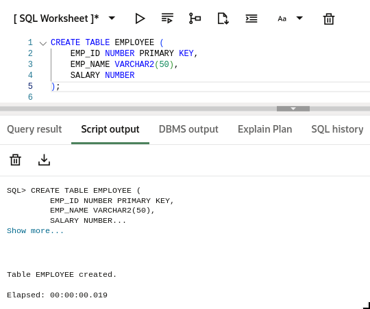
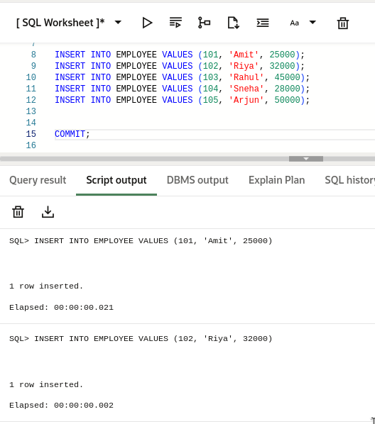
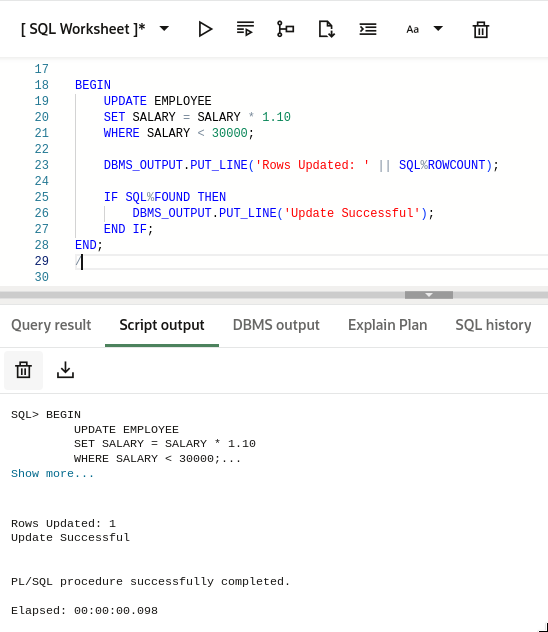
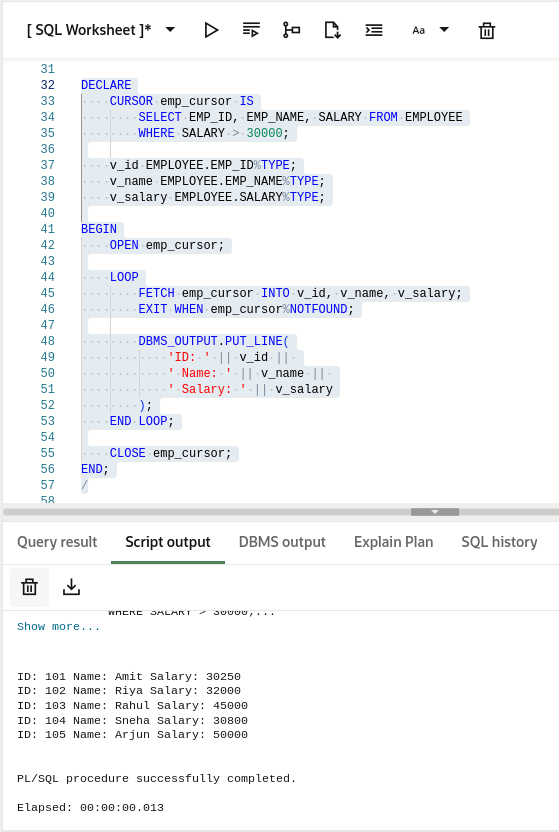
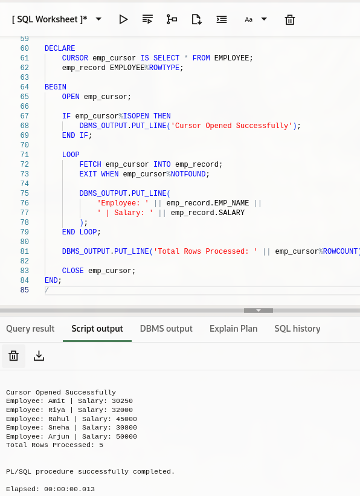

# Experiment 6 – Understanding and Implementing Cursors for Row-by-Row Data Processing (Oracle, Accenture, Scaler, D. E. Shaw & Co)

## Experiment
**Experiment 6:** Working with PL/SQL cursors to process multiple rows of a table individually. This experiment demonstrates the use of implicit cursors, explicit cursors, and cursor attributes to implement business logic on row-by-row data in Oracle and PostgreSQL.

---

## Aim
To understand the concept and working of cursors in PL/SQL for row-by-row data processing, and to analyze how implicit cursors, explicit cursors, and cursor attributes are used to implement business logic on multiple rows in a database table.

---

## Objective
- To implement and analyze implicit cursors for single-row operations.  
- To implement explicit cursors to fetch and process multiple records.  
- To apply cursor attributes (%FOUND, %NOTFOUND, %ROWCOUNT, %ISOPEN) for controlling program flow.  
- To process employee records row by row and apply business logic effectively.  

---

## Software Requirements

### Database Management System:
- Oracle Database Express Edition (Oracle XE)  
- PostgreSQL Database  

### Database Administration Tool / Client Tool:
- Oracle SQL Developer (for Oracle XE)  
- pgAdmin (for PostgreSQL)  

---

## Problem Statement
In real-world enterprise applications, database queries often return multiple rows that need to be processed individually to apply specific business rules. Using cursors allows row-by-row processing for detailed business logic implementation.

---

## Practical / Experiment Steps
1. Design PL/SQL programs that demonstrate:  
   - The use of implicit cursors for single-row DML operations  
   - The use of explicit cursors to fetch and process multiple records  
   - The application of cursor attributes to control program execution  

2. Create PL/SQL programs to:  
   - Fetch employee records from a database table using cursors  
   - Process each record individually  
   - Display results or apply business logic using cursor attributes  

---

## Procedure
1. Open Oracle SQL Developer or pgAdmin and connect to the database.  
2. Create an employee table with sample data (id, name, department, salary).  
3. Write an anonymous PL/SQL block demonstrating implicit cursor operations.  
4. Write a PL/SQL block using an explicit cursor to fetch and process multiple records.  
5. Apply cursor attributes such as %FOUND, %NOTFOUND, %ROWCOUNT, %ISOPEN to control execution flow.  
6. Execute the blocks and observe the output.  
7. Capture results and screenshots for documentation.  

---

## Input / Output Details

### Input
**employee table:**  
- id (Integer)  
- name (Varchar)  
- department (Varchar)  
- salary (Integer)  

**Cursor logic used:**  
- Implicit cursor for single-row processing  
- Explicit cursor for multi-row processing  
- Cursor attributes (%FOUND, %NOTFOUND, %ROWCOUNT, %ISOPEN)  

---

## Step-wise Output
**Step 1 – Create employee Table**  

**Step 2 – Insert Data into employee Table**  
  

**Step 3 – Implicit Cursor Operation**  
 

**Step 4 – Explicit Cursor Declaration and Fetch**  

**Step 5 – Process Records Using Cursor Attributes**  

---

## Learning Outcome
After completing this experiment, the learner will be able to:  
- Understand the role of cursors in PL/SQL for handling multi-row query results.  
- Differentiate between implicit cursors and explicit cursors.  
- Use cursor attributes such as %FOUND, %NOTFOUND, %ROWCOUNT, and %ISOPEN.  
- Develop PL/SQL programs that process database records row by row.  
- Apply cursor-based logic in real-world business scenarios used in organizations like Oracle, Accenture, Scaler, and D. E. Shaw & Co.
