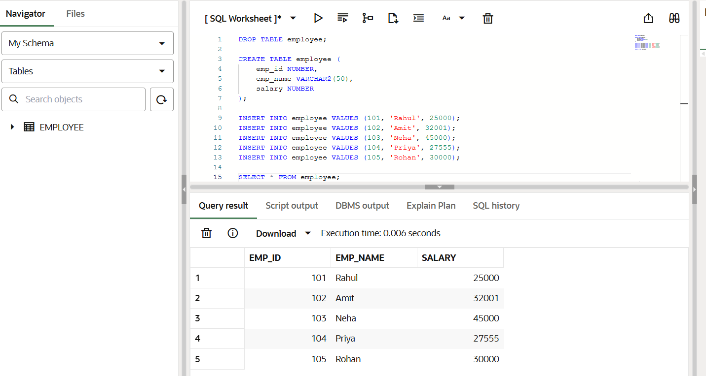
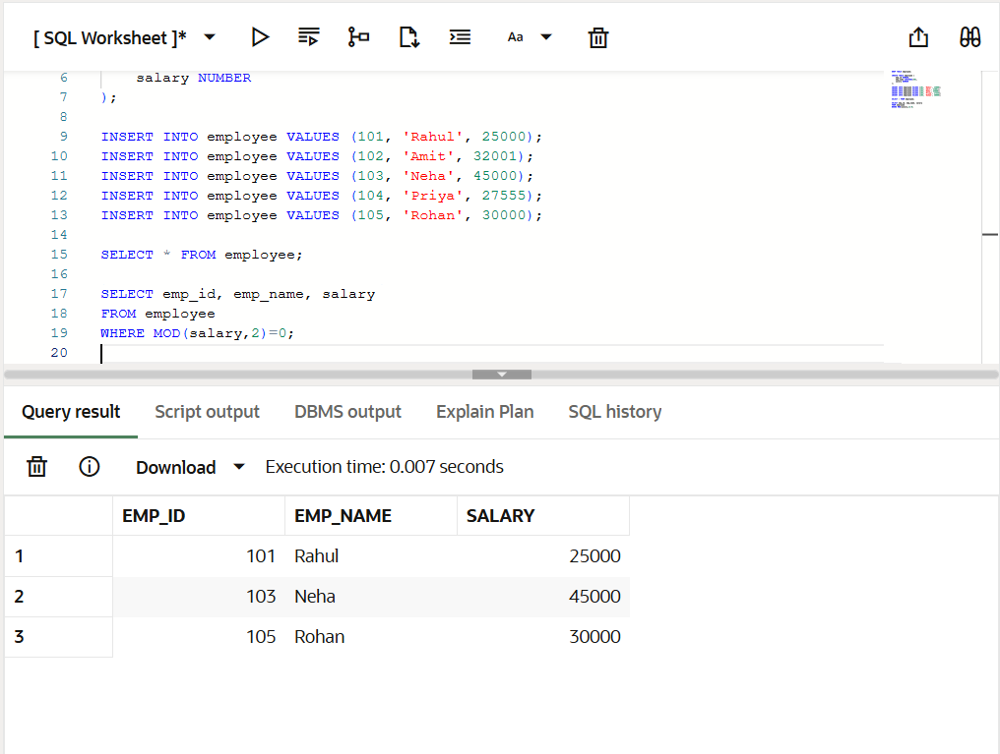
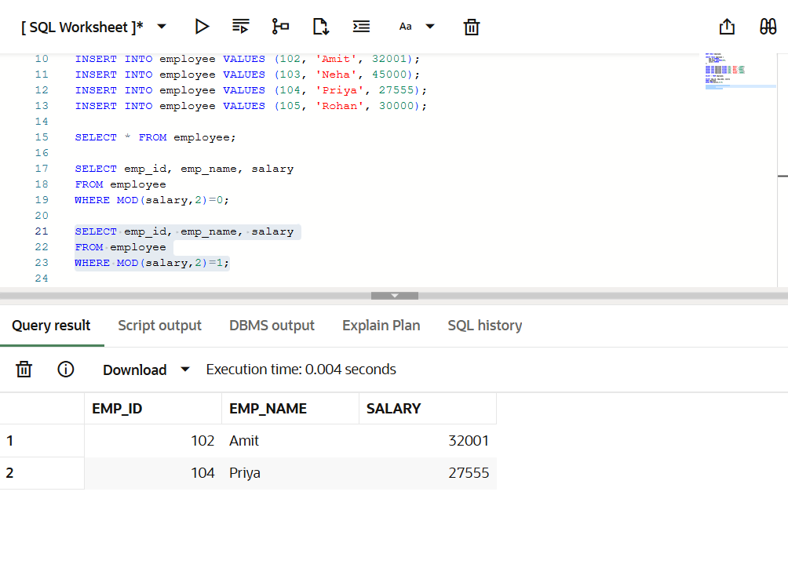
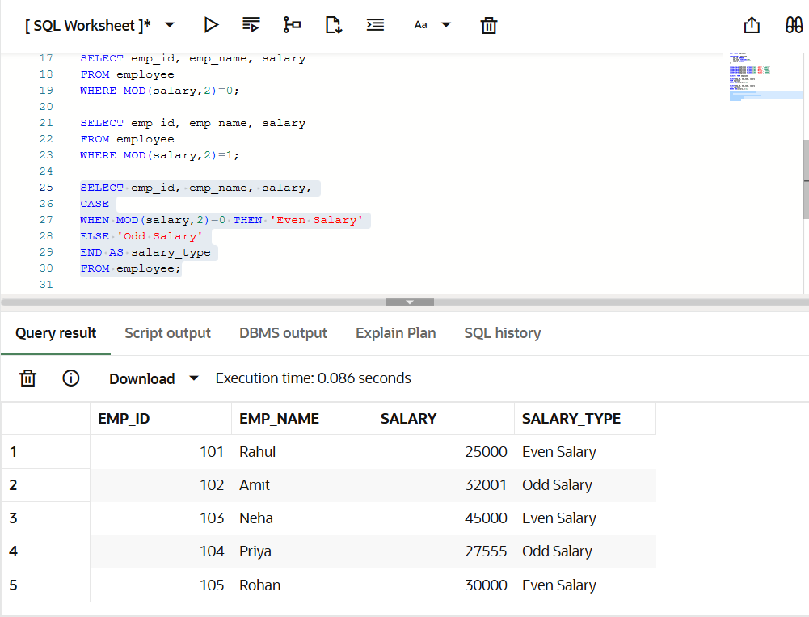

# Experiment 05 – SQL Conditional Logic (Odd & Even Values)

---

## AIM

To understand and apply conditional logic in SQL using the **MOD (%) operator** to analyze numerical data and classify employee salaries as **odd or even**, thereby improving SQL data analysis and query-writing skills.


---

## Software Requirements

* **Database Management System:** PostgreSQL
* **Database Administration Tool:** pgAdmin

---

## Objective

To write and execute SQL queries that use the **MOD (%) operator** to check employee salaries and display **odd and even salary values separately** from an employee table.

---

## Problem Statement

Develop and execute SQL queries that demonstrate conditional logic using the **MOD (%) operator**.  
The queries should analyze employee salary values and classify them as **odd** or **even**, demonstrating data filtering and logical classification in SQL.


---

## Problem 1: Display All Employee Details

### Description

Create an employee table, insert sample records, and display all employee details.

### Program

```sql
CREATE TABLE employee (
    emp_id NUMBER,
    emp_name VARCHAR2(50),
    salary NUMBER
);

INSERT INTO employee VALUES (101, 'Rahul', 25000);
INSERT INTO employee VALUES (102, 'Amit', 32001);
INSERT INTO employee VALUES (103, 'Neha', 45000);
INSERT INTO employee VALUES (104, 'Priya', 27555);
INSERT INTO employee VALUES (105, 'Rohan', 30000);

SELECT * FROM employee;
```

---

## Problem 2: Display Employees with Even Salary

### Description

Write an SQL query to display employees whose salary values are even numbers using the MOD operator.

### Program

```sql
SELECT emp_id, emp_name, salary
FROM employee
WHERE MOD(salary, 2) = 0;
```

---

## Problem 3: Display Employees with Odd Salary

### Description

Write an SQL query to display employees whose salary values are odd numbers using the MOD operator.

### Program

```sql
SELECT emp_id, emp_name, salary
FROM employee
WHERE MOD(salary, 2) = 1;
```

---

## Problem 4: Classify Salary as Odd or Even

### Description

Write an SQL query to classify each employee salary as Odd or Even using a CASE statement.
### Program

```sql
SELECT emp_id,
       emp_name,
       salary,
       CASE
           WHEN MOD(salary,2)=0 THEN 'Even Salary'
           ELSE 'Odd Salary'
       END AS salary_type
FROM employee;
```

---

## Output : 
## Display All Employee Records


## Employees with Even Salary


## Employees with Odd Salary


## Salary Classification (Odd / Even)


---

## Learning Outcomes

1. Understood the use of conditional logic in SQL queries.
2. Learned how the MOD (%) operator helps determine odd and even numbers.
3. Implemented SQL queries to filter data based on conditions.
4. Used CASE statements for classifying data values.
5. Improved logical thinking and SQL query writing skills.
---

## Conclusion

This experiment demonstrated the application of conditional logic in SQL using the MOD operator. By analyzing employee salary data and classifying it as odd or even, the experiment highlighted how SQL can be effectively used for data filtering, analysis, and logical decision-making in database systems.
