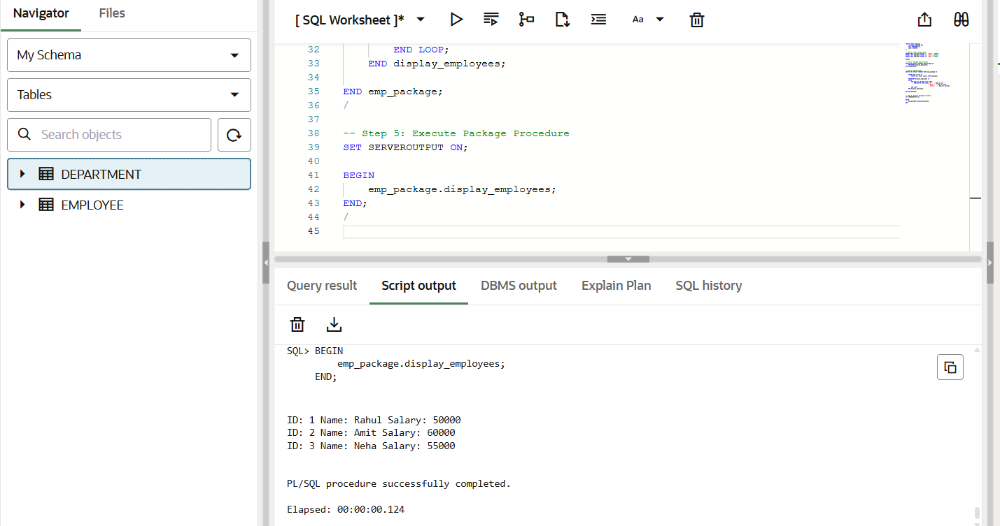

# Experiment 9: Creating and Implementing Packages in PL/SQL (Rippling, Oracle, SAP, PayPal)

---

## Aim
To design and implement a **PL/SQL package** that includes procedures and shared cursors to fetch and display employee details.

---

## Software Requirements

### Database Management System
- Oracle Database Express Edition (Oracle XE)

### Client Tool
- Oracle SQL Developer  

---

## Objective
To create and execute a **PL/SQL package** using:
- Package Specification  
- Package Body  
- Shared Cursor  
- Procedure  

---

## Problem Statement
In enterprise applications, database operations are grouped into packages to improve:
- Code reusability  
- Maintainability  
- Performance  

---

## Theory
A **PL/SQL Package** is a schema object that groups logically related procedures, functions, and cursors.

- **Package Specification** → Declares procedures and variables  
- **Package Body** → Implements the logic  
- **Cursor** → Fetches multiple records from a query  
- Improves modular programming and security  

---

## Table Creation

```sql
CREATE TABLE employee (
    id NUMBER PRIMARY KEY,
    name VARCHAR2(50),
    salary NUMBER
);
```
## Inserting Sample Data

```sql
INSERT INTO employee VALUES (1, 'Rahul', 50000);
INSERT INTO employee VALUES (2, 'Amit', 60000);
INSERT INTO employee VALUES (3, 'Neha', 55000);
COMMIT;
```
## Package Specification

```sql
CREATE OR REPLACE PACKAGE emp_package AS
    PROCEDURE display_employees;
END emp_package;
/
```
## Package Body

```sql
CREATE OR REPLACE PACKAGE BODY emp_package AS

    CURSOR emp_cursor IS
        SELECT id, name, salary FROM employee;

    PROCEDURE display_employees IS
    BEGIN
        FOR emp_rec IN emp_cursor LOOP
            DBMS_OUTPUT.PUT_LINE(
                'ID: ' || emp_rec.id ||
                ' Name: ' || emp_rec.name ||
                ' Salary: ' || emp_rec.salary
            );
        END LOOP;
    END display_employees;

END emp_package;
/

```
## Execution Block

```sql
SET SERVEROUTPUT ON;

BEGIN
    emp_package.display_employees;
END;
/
```
##Output

## Steps Performed
- Created the employee table
- Inserted sample employee records
- Created package specification
- Created package body
- Declared shared cursor
- Executed package procedure
- Displayed output

---

## Result
The PL/SQL package successfully fetched and displayed employee details using a shared cursor.

---
## Learning Outcome

After completing this experiment, the learner is able to:

- Understand PL/SQL package structure
- Differentiate between package specification and body
- Implement procedures inside packages
- Use shared cursors effectively
- Develop modular and reusable database programs

## Screenshots

